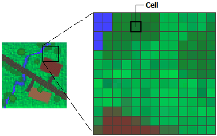

### What is a Satellite Imagery?

When we talk about satellite data, we continously hear about spatial data. Mostly yes, because of the underlying definition of the spatial data. `Spatial data`, also known as   `geospatial data`, is a term used to describe any data related to or containing information about a specific location on the Earth’s surface.

Satellite image is more than just a simple image (like a web image or gif), it is image + some additional information. It is this additional data that makes it special.

💡 If you want to know more about how satellite imagery is different than normal photographs, read [here](files/satelliteim_info.pdf).

Satellite imagery in general comprises of spectral bands which basically means that the spatial data captured has more than one information for each pixel. The images captures can be fetched in the form of rasters (matrix of cells/pixels) organized into rows and columns (or a grid) where each cell contains a value representing information (such as temperature).

### Can we have satelite data in a form other than raster data?
Yes, there also exist vector data for GIS data types. Unlike raster,vVector data is not made up of a grid of pixels. Instead, vector graphics are comprised of vertices and paths.

### Software:
Some popular geospatial data use 1.) GDAL or 2.) PROJ5

### Libraries:
Python libraries popular to visualize data: 1.)Rasterio (python wrapper around GDAL) 2.) NumPy 3.) Matlotlib

### Code Installation and Setup

Requirements:
- python==3.7
- rasterio==2.4.4
- fiona==1.8.18
- numpy==1.20.3
- matplotlib==3.3.4
- humanize==3.8

### Base files
Source file used in the code can be downloaded from the link below:
Link: https://drive.google.com/drive/folders/1zbZVT07RjATmcmBEMEWsEWqLhxDvX_3E?usp=sharing
